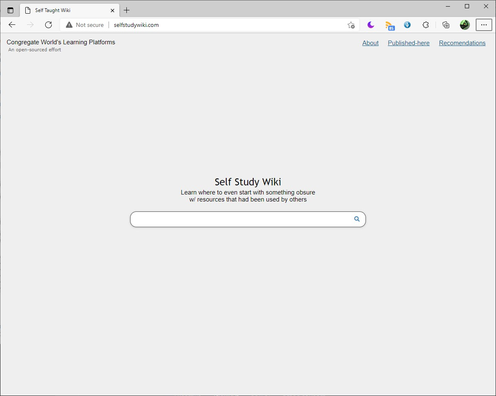

# Self Study Wiki&nbsp;<small><small>*(sswiki)*</small></small>
<!-- 

  
Table of Contents

  <ol>
    <li>
      <a href="#about-the-project">About The Project</a>
      <ul>
        <li><a href="#built-with">Built With</a></li>
      </ul>
    </li>
    <li>
      <a href="#getting-started">Getting Started</a>
      <ul>
        <li><a href="#prerequisites">Prerequisites</a></li>
        <li><a href="#installation">Installation</a></li>
      </ul>
    </li>
    <li><a href="#usage">Usage</a></li>
    <li><a href="#roadmap">Roadmap</a></li>
    <li><a href="#contributing">Contributing</a></li>
    <li><a href="#license">License</a></li>
    <li><a href="#contact">Contact</a></li>
    <li><a href="#acknowledgments">Acknowledgments</a></li>
  </ol>

 -->

  [![Initial Developer](https://img.shields.io/badge/Init%20Developer-speedstor.net-dce.svg?logo=data:image/png;base64,iVBORw0KGgoAAAANSUhEUgAAACAAAAAgCAYAAABzenr0AAAABGdBTUEAALGPC/xhBQAAACBjSFJNAAB6JgAAgIQAAPoAAACA6AAAdTAAAOpgAAA6mAAAF3CculE8AAAABmJLR0QA/wD/AP+gvaeTAAAFuElEQVRYw+2W3W8U1xnGf+djZnZ3Zvy1XmPWprgNigCTqkJoIamgqUjURBGqol5UlXqD1KtW5YL8A7mumrv2H+hVryoVqXdQRKoSMQWitDhIkCBMWH+sbWyvvTszOztzerFes/6E9La80pk5c+bMeZ7zvO9554VX9v9mlUrF6X3W3/JjC3jXOmSdtw7rSeGJEkAWZrXkcXuqPd2+ClwLgiDZ4/txIA88/FYEKpWKowfUJbfiXrYmrFFZlAgP5LDEKIORBiPNe8lM+6P4X63ZM0NnPsmeZX8IgiDettRF4He9A+IlwL+fO+T82XrdOpYdNIiyQBQgWzeYOYNqSfKncoii7BIhXUtp/qU5Ff09/nkQBFMb62jgehAEZ1/aBafPnH7bGtFXnA8c337TxggDAowAhMEIMJmhcT3EsjW5Uw4ZoHyFd9GbVOP6ZkVVLgSfBZ8CF+I4bm7H2FOBSqXyhjWs/znw6wFfj6utoLJL5Pk9+TJBLAlyFWdTCSOheTWsN/7UeCuO49+22+1Drut+EATBJo7ay+eWr68O/mJwLH/YQaYSmQpEKpBZt99zzwS6qEmm2ygtka7a3Jv1mnaylewcT/lNq9X6WClVm52d/aKLJXcjYPvWJW/SPeYfLqAjjY4UOlZYcbev0XFnTLcUaqPvnSoQ3YmRqei0TCAygfth4YQclB+6rnsxiqI/VioVf88YqFQqlnugcNn9bgfcyI7sSIPZ7oKese57ZStogsh3FJAGhK/In8191LjSnHBd9x6Q7EkAeMdxnVF/xENFcpOAEWYnsNyIg545hdEcyZMU+4iFwWCMITOG3MncWONK88fArXa7He1JwC0Wzjt5i5yxMdELgHv63TnYhtZiA5kKjIFMdVSwyxa6rM+3Z9o37t69u/cx9IYKJyQS1VQIzZbdb3GF3J1cup4ilUSmkswY5KYKGfaENdmeaf9+3zygLV1yvTzJfEKhmN/m4+dAe7miUW2SO+4g2xJU1qOCROblSBAEi/sSEJmgv9jH7IMafa6/scPeOOjmg91jIHrWQn4hKa6X8CyPmq5RP7mKLiuE2Zl2dhBI43QhXI5YW2pg1jK0o7eC9qohDHRdIQzNesT6l03OvXmO0mslfN/H8zw++/wmX+e+wqyb2gsJrNTq96bu3P9JFHXO84kfvA5SbJG9m/16x9ppysyDecojZbIsIwxDtNZorXnr5A95ePcBrSetqe14OxJR2IiuuZ5HsTTE+LGDPHr4DSY06EShWhIdK1QsUa2NJNRSpKsp019V8Sc9lFREUUQYhoRhSBRGJEmC/dShNZdce6ECwNWjbxyZmzg6PoqCwvEc019XyaU2I6VhbNvaVCCMIuZqCyysP6P/qI/taNYba/RH/Zu7t6xOPpi7P18Frm8H2/EvqFarWXFwWB4sj7yrlEJKSd+whzVosbC6xGJ9meXGKkvRCstJHSU8jp86y+DIMVZnBbXpR+R1DsuykFIihCC4HTA/N/9xEAQ3X0gA4MCB0TtZO/1ZqTRU6satUhJ3oIBfcnFHXLwRl2gBJs/8iKzPIy7kUWNl2rk8YesRa6trrKyt8CR6zPzK/L1kJflVtVpNX4pAtVpNfa//U9u2f9nf5zsCEEIgELBxNakhTQbIjZVp2lanORbt0jBW7T7F0wM4RzSNZ4360ufL7wdBMLcb1p4FSRAE/xFS/FQY/jo2cdAHA50jjzESBMRkNBxNaFk0LU1oaxpxxKDSyFRQ+/dSfeYf8xe6VdFuptjHqk+rjx278LdWnLw90O+XtHo+XSBYqS2Sfed7RG6B0LYILU3rxg1GhzKe3pqbmr1dez+4FdzeD+OFNSF0CpRc3rk0Nn7g8ki5OFroy2MUpKRMf7NMffQwSS5H8uAhbn1+dm1x/ZNWI9mtKP3fCPQQsYF3/H7vvD/gTmpblRAQx63aykJ9Km629i3LX9kr283+C7Vd3slBENmyAAAAJXRFWHRkYXRlOmNyZWF0ZQAyMDIxLTEwLTE4VDExOjQ3OjQxKzAwOjAwusc4PgAAACV0RVh0ZGF0ZTptb2RpZnkAMjAyMS0xMC0xOFQxMTo0Nzo0MSswMDowMMuagIIAAAAASUVORK5CYII=)](https://speedstor.net)        

- [Self Study Wiki&nbsp;<small><small>*(sswiki)*</small></small>](#self-study-wikismallsmallsswikismallsmall)
  - [:golf: Roadmap](#golf-roadmap)
  - [:blue_book: Brief Documentation](#blue_book-brief-documentation)
    - [Directory Structure](#directory-structure)
    - [Current server setup](#current-server-setup)
  - [:green_heart: Contribute Code](#green_heart-contribute-code)
          - [Made by speedstor](#made-by-speedstor)

---

##### 💡 To create a platform that combines the power of search engines with concept of wikis

The end goal of this platform is to effectively link resources to "complex" topics -- e.g. `quantum physics`, `ctf`, `RISC-V`... But let's not get ahead of ourselves, the platform will start with topics along the lines of `how to code`, `javascript`... The justification of this effort is to make a specialized place on the web for learning practical skills and concepts. The problem with google is that it is almost entirely guided by machines only, and for complex topics, it isn't enough. 
  

## :golf: Roadmap

- Finish basic functionalities of the website
  - bugs in editing a page
  - documentation for how first-adopters can contribute (not everyone can edit at first)
    - provide a route for first-adopters to contribute (email?)
  - self-publish pages (page builder that is specialized for tutorials -> video & text)
  - polish the search functionality (tag system, neural network, or both/more)
  - image upload module in the codebase (cdn)
  - static pages
    - about
    - mission statement
  - mobile version (css)
- Web Crawler 
  - **only for the search page**
  - the concept now is just google but with mainly link wiki pages instead
- P2P/onion site
  - allow the server to be distributed
  - anyone can download the whole database
    - along with the web crawler indexes
  - figure out how to update features (CI: continuous integration?)
- Add a way for a voting system on feature changes (both what to work on / and what is accepted)
  - And how to integrate with P2P/onion site
 

## :blue_book: Brief Documentation

### Directory Structure
|directory   |sub_dir   | content |
|---|---|---|
|/.backstage/   |   |  for coding references, sequential verbose messy codes |
|/.topic/ | ./ | php html card modules files (seperated files that are included in `topic.php` `create.php` `edit.php`) 
| | ./create/ | for `create.php` `edit.php` |
| | ./modules/ | for `topic.php` |
| <small>/*AMA*/</small> | | <small>*temp static website for speedstor.net, sorry :)* </small>|
| /api/ | | temporary location for things that are supposed to be from a cdn |
| <small>/css/</small> | | <small>css files</small> |
| /feedbackPages/ | | Basically, are error pages. Users are redirected to pages here if something unexpected happens |
| /includes/ | | Blocked pages. They are for logins, authentication, database manipulation, admin stuff...|
| <small>/js/</small> | | <small>javascript code</small> |
| /login/ | | front end for logging in, log out, and stuff |
| /requries/ | | for communicating with database (might need to move) |
| /secure/ | | a more exclusive version of include. Error here can leak a lot of things and surrender control for the server |
| /src/ | | static images for website |
| / | | pages, main pages |

### Current server setup
- docker
  - mysql
  - php
  - adminer
- haproxy
  - to share server with speedstor.net
- contact aldrin.cheung@gmail.com to get details
 

## :green_heart: Contribute Code

Any help on this project would be great appriciated :D. Because this project is currently so small, there are no rules. Just fork and submit a pull request :smirk:.

  

###### Made by [speedstor](https://speedstor.net)
  
